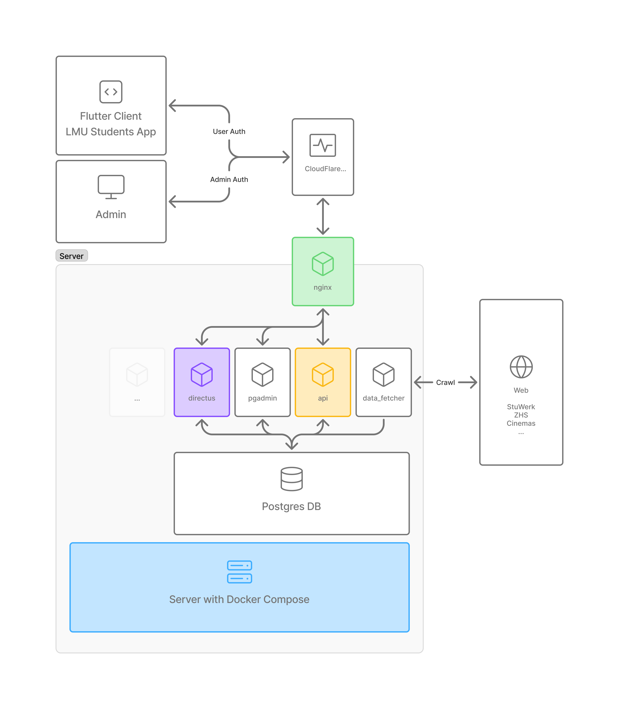
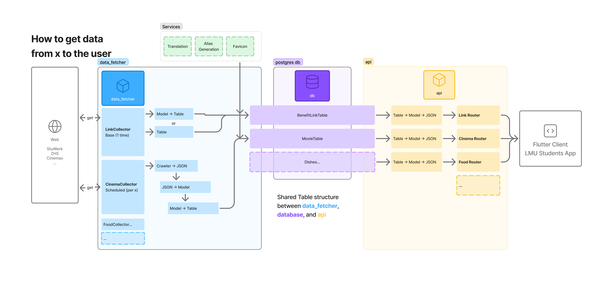

# LMU App Backend

This is the backend service for the LMU App. It provides the necessary API endpoints and data processing for the LMU application.

[API Documentation](/api/README.md) 

[Data Fetcher Documentation](/data_fetcher/README.md)

## Table of Contents
- [LMU App Backend](#lmu-app-backend)
  - [Table of Contents](#table-of-contents)
  - [Structure](#structure)
    - [High Level Structure](#high-level-structure)
    - [Data Flow](#data-flow)
  - [Tech Stack](#tech-stack)
  - [Prerequisites](#prerequisites)
  - [Installation](#installation)
  - [Environments](#environments)
    - [Development](#development)
    - [Staging](#staging)
    - [Production](#production)
  - [Components](#components)
  - [Branching Strategy](#branching-strategy)
  - [CI/CD Pipeline](#cicd-pipeline)
  - [Deployment Workflow](#deployment-workflow)
  - [Directus \& GraphQL](#directus--graphql)
    - [GraphQL](#graphql)
  - [Usage](#usage)

## Structure
### High Level Structure


### Data Flow



## Tech Stack

- FastAPI - Modern Python web framework
- PostgreSQL - Primary database
- Docker Compose - Container orchestration
- Nginx Proxy Manager - Reverse proxy and SSL management
- Metabase - Data analytics and visualization
- PgAdmin - Database management interface

## Prerequisites

Before you begin, ensure you have met the following requirements:
* You have installed the latest version of [Python](https://www.python.org/downloads/) (3.12 recommended)
* You have installed [Docker](https://www.docker.com/get-started) and [Docker Compose](https://docs.docker.com/compose/install/)
* You have a Windows/Linux/Mac machine

## Installation

1. Clone the repository:
   ```
   git clone https://github.com/lmu-devs/lmu_app_backend.git
   cd lmu_app_backend
   ```

2. Create a virtual environment:
   ```
   python -m venv venv
   ```

3. Activate the virtual environment:
   - On Windows:
     ```
     venv\Scripts\activate
     ```
   - On macOS and Linux:
     ```
     source venv/bin/activate
     ```

4. Install the required dependencies:
   ```
   pip install -r requirements.txt
   ```

5. Copy the environment template (Ask a developer for the .env file):
   ```
   cp .env.template .env
   ```

6. Run docker compose:
   ```
   docker compose up db api_dev data_fetcher_dev -d
   ```

## Environments

The application supports three environments:

### Development

The development environment is used for local development and testing.

- Run the application using Docker Compose with development services:
  ```
  docker compose up api_dev data_fetcher_dev db db_mb pgadmin metabase nginx --build
  ```

This setup uses the `api_dev` and `data_fetcher_dev` services which mount the local codebase as a volume, enabling:
- Hot-reload: Code changes are reflected immediately without rebuilding containers
- Live debugging: Changes to the codebase are immediately available in the containers
- Development workflow: Edit code locally while running services in containers

### Staging

The staging environment is hosted on a Digital Ocean droplet.

- URL: `{service}-staging.lmu-dev.org`
- IP: `157.230.114.51`
- DNS: Managed through Cloudflare
- Deployment: Automatic when code is pushed to the `staging` branch

### Production

The production environment is hosted on a Digital Ocean droplet.  
Available services: 
[api.lmu-dev.org](https://api.lmu-dev.org)  [metabase.lmu-dev.org](https://metabase.lmu-dev.org)  [pgadmin.lmu-dev.org](https://pgadmin.lmu-dev.org)  [nginx.lmu-dev.org](https://nginx.lmu-dev.org)  

- URL: `{service}.lmu-dev.org`
- IP: `64.226.106.247`
- DNS: Managed through Cloudflare
- Deployment: Automatic when code is pushed to the `main` branch

## Components

The application consists of several Docker services:

1. **API** (`api`):
   - Main FastAPI application
   - Exposed on port 8001 (localhost)
   - Development mode available with hot-reload (`api_dev`)

2. **Data Fetcher** (`data_fetcher`):
   - Background data processing service
   - Development mode available (`data_fetcher_dev`)

3. **Database** (`db`):
   - PostgreSQL 16.4
   - Centralized database for all services

4. **PgAdmin** (`pgadmin`):
   - Database management interface
   - Configurable port through environment variables

5. **Metabase** (`metabase`):
   - Data analytics platform
   - Exposed on port 3000
   - Separate PostgreSQL instance (`db_mb`) on port 5433

6. **Nginx Proxy Manager** (`nginx`):
   - Reverse proxy and SSL management
   - Ports 80 and 443

## Branching Strategy

We follow a trunk-based development strategy:

1. `main` - Production branch, represents live code
2. `staging` - Integration branch for testing
3. Feature branches - Created from `staging`

Workflow:
1. Create feature branch from `staging`
2. Develop and test
3. Create PR to merge into `staging`
4. After testing, merge `staging` into `main`

## CI/CD Pipeline

GitHub Actions automation:

1. **Continuous Integration**:
   - Runs on all pull requests
   - Formats code
   - Executes test suite (TODO)
   - Performs code quality checks (TODO)

2. **Staging Deployment**:
   - Triggered on `staging` branch updates
   - Builds and tags Docker images
   - Deploys to staging environment

3. **Production Deployment**:
   - Triggered on `main` branch updates
   - Uses staging-verified images
   - Deploys to production environment

## Deployment Workflow

1. **Development**:
   ```
   docker compose up
   ```

2. **Staging**:
   - Automatic deployment from `staging` branch
   - Manual: `docker compose up db api data_fetcher --build`

3. **Production**:
   - Automatic deployment from `main` branch
   - Manual: `docker compose up db api data_fetcher --build`

## Directus & GraphQL
The directus cms is used to manage the content for the application.  
The graphql api is used to query the data from the database.

### GraphQL

To setup a nice developer experience for the graphql api, we recommend installing the [GraphQL: Language Feature Support](https://marketplace.visualstudio.com/items?itemName=GraphQL.vscode-graphql) extension for VSCode. 

Setup:
- Copy the .graphqlconfig.example file to .graphqlconfig
- Replace the `<DIRECTUS_ACCESS_TOKEN FROM .env>` with your directus access token
- Press `Ctrl+Shift+P` and select `VSCode GraphQL: Manual Restart`
- Autocomplete should work now


## Usage

After deployment, the following services are available:

- API Documentation: `http://localhost:8001/v1/docs`
- REST API: `http://localhost:8001/v1`
- PgAdmin: `http://localhost:5050`
- Metabase: `http://localhost:3000`
